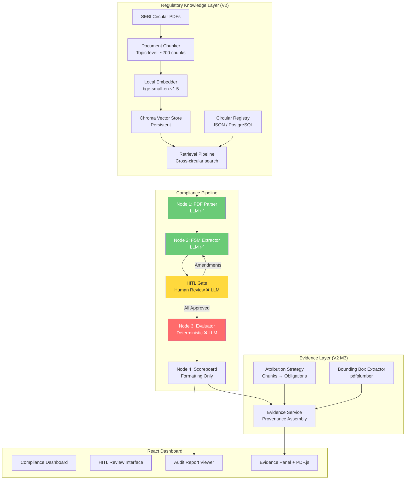

# 🛡️ RuleBridge — Explainable AI for SEBI Regulatory Compliance

<p align="center">
  
  
  
  
  
  
  
  
</p>

<p align="center">
  <strong>Automated compliance verification for stock brokers against SEBI regulatory circulars — with full audit trail and explainable AI.</strong>
</p>

<p align="center">
  <em>Built for the <strong>SEBI Securities Market TechSprint — Problem Statement 2</strong></em>
</p>

<p align="center">
  <a href="#-live-dashboard"><strong>🖥️ Live Dashboard</strong></a> &nbsp;·&nbsp;
  <a href="#-demo-video"><strong>🎥 Demo Video</strong></a> &nbsp;·&nbsp;
  <a href="#-project-documentation"><strong>📖 Docs</strong></a> &nbsp;·&nbsp;
  <a href="#-project-gallery"><strong>🖼️ Gallery</strong></a> &nbsp;·&nbsp;
  <a href="#-quick-start-under-5-minutes"><strong>⚡ Quick Start</strong></a> &nbsp;·&nbsp;
  <a href="https://github.com/YOUR_ORG/agentic-compliance"><strong>📂 GitHub</strong></a>
</p>

---

## 🖥️ Live Dashboard

> **Explore RuleBridge live** — a deployed instance with sample data (coming soon).

<div align="center">

| Resource | Link |
|----------|------|
| 🖥️ **Live Dashboard** | *Coming soon* |
| 📊 **Sample Audit Report** | *Coming soon* |
| 🔍 **Evidence Viewer Demo** | *Coming soon* |

</div>

---

## 🎥 Demo Video

> **Watch RuleBridge in action** — 5-minute walkthrough of the full compliance verification pipeline.

<p align="center">
  <em>🎬 Demo video coming soon — placeholder for hackathon presentation video link</em>
</p>

---

## 📖 Project Documentation

<div align="center">

| Document | Description |
|----------|-------------|
| [📋 README](#-rulebridge--explainable-ai-for-sebi-regulatory-compliance) | Project overview, architecture, and setup (you are here) |
| [📐 V2 Roadmap](docs/v2_roadmap.md) | Complete V2 milestone plan with architectural decisions |
| [🔬 V2 Verification Plan](docs/v2_verification_plan.md) | End-to-end test plan (14 phases, 66 steps) |
| [🔌 API Reference](http://localhost:8000/docs) | Interactive Swagger UI with all 25 endpoints |
| [📖 Business Case](#-problem-statement) | Problem statement and why RuleBridge matters |
| [🏗️ Architecture](#-system-architecture) | Mermaid diagram + architectural principles |

</div>

---

## 🖼️ Project Gallery

> *Screenshots of the RuleBridge dashboard (coming soon).*

<div align="center">

| | | |
|:---:|:---:|:---:|
| 🖥️ **Dashboard** | ✅ **HITL Review** | 📊 **Audit Report** |
| *Pipeline trigger, run status* | *FSM approval workflow* | *Per-broker scorecards* |
| 🔍 **Evidence Viewer** | 📄 **PDF with Highlights** | 🔗 **Provenance Chain** |
| *Side-by-side PDF + trace* | *Source text highlighting* | *Verdict → Chunk trace* |

</div>

---

## 📋 Problem Statement

SEBI (Securities and Exchange Board of India) issues dozens of regulatory circulars annually. Stock brokers must comply with every obligation or face penalties. Today, compliance officers **manually read hundreds of pages of circulars** and cross-reference them against operational data — a process that is:

- **Slow** — weeks of manual review per circular
- **Error-prone** — obligations are missed or misinterpreted
- **Opaque** — no automated audit trail linking decisions to regulations
- **Unscalable** — each new circular resets the clock

RuleBridge solves this by combining **LLM-powered regulation extraction** with **deterministic compliance evaluation** and **full evidence traceability**.

---

## 🎯 Why RuleBridge Matters

| Traditional Approach | RuleBridge |
|---|---|
| Manual reading of 400-page circulars | AI parses PDFs into structured obligations in minutes |
| Compliance officers cross-reference spreadsheets | Deterministic FSM engine evaluates telemetry automatically |
| "Trust me" audit reports | SHA-256 hash-chain with cryptographic integrity |
| No link from finding → regulation | Click any verdict, see the exact PDF passage that produced it |
| Human-only — doesn't scale | Human reviews machine output, machine handles scale |

**RuleBridge is not a black-box AI auditor.** The LLM *only* reads regulations. Every compliance *decision* is deterministic. Every finding is traceable. A human must approve before execution.

---

## ✨ Key Features

### 🔍 Regulatory RAG (Retrieval-Augmented Generation)
- Multi-circular indexing with **bge-small-en-v1.5 embeddings** (384-dim)
- Topic-level chunking — 200 coherent chunks from a 399-page Master Circular
- Cross-circular semantic search with provenance metadata
- Circular Registry with SHA-256 document hashing and index versioning
- **`use_rag` feature flag** — zero-risk integration, V1 path preserved

### 🧠 Hybrid FSM Obligation Extraction
- LLM-powered extraction of obligations as **Hybrid Finite State Machines**
- Timeline-based deadlines (T+0, T+1, T+2, T+3, custom)
- Mixed state types: compliance states + timeline-aware transition rules
- Batch extraction with configurable DeepSeek timeout

### 👤 Human-in-the-Loop (HITL) Approval
- Every extracted FSM must be **approved, rejected, or amended** by a human reviewer
- Immutable review audit log (INSERT-only)
- Amendment history tracking with versioning
- Hash-chain anchoring for cryptographic integrity
- **Hard gate** — evaluator never runs until all FSMs are reviewed

### 🔗 Evidence Traceability
- Complete provenance chain: **Circular → Page → Section → Chunk → Parser → Obligation → FSM → Verdict**
- Conservative attribution strategy (swappable via Protocol)
- Bounding-box extraction with **pdfplumber** — word-level position data
- PDF.js viewer with **highlighted passages** in the frontend
- `GET /api/evidence/{verdict_id}` — one API call for the full chain

### ⚖️ Deterministic Compliance Verification
- **Node 3 (Assertion Evaluator) never calls an LLM** — zero non-determinism
- First-match transition resolution, earliest-event reference time
- End-of-trading-day deadline semantics
- Error-isolated evaluation — one FSM failure doesn't block others
- 1:1 evidence mapping per verdict
- Verified by **6 AST-level safety gate tests**

### 📊 Audit Report Generation
- Per-broker compliance scorecards with percentage breakdowns
- Five-tier scoring rubric
- SHA-256 hash-chain integrity seal
- Deterministic explanation column for every verdict
- Immutable report generation (reports are append-only)

---

## 🏗️ System Architecture



### Architectural Principles

| # | Principle | Constraint |
|---|-----------|------------|
| P1 | **Deterministic Evaluation** | Node 3 must never call an LLM, make HTTP requests, or perform non-deterministic operations |
| P2 | **Human-in-the-Loop** | Human approval required before any FSM enters the evaluator |
| P3 | **Full Audit Trail** | Every compliance finding must be traceable to the originating regulation text |
| P4 | **Explainability** | Every verdict must be explainable from the FSM + telemetry alone |
| P5 | **Backward Compatibility** | V1 API surface preserved; all V1 tests continue to pass |

---

## 🗺️ Knowledge Graph (Graphify)

RuleBridge integrates with **Graphify** — a persistent knowledge graph that maps:

- Pipeline topology (nodes, edges, state transitions)
- Code-to-architecture relationships
- File dependencies and import graphs
- System component relationships

Graphify enables semantic queries over the codebase, community detection for architectural analysis, and path tracing for understanding data flow.

```bash
# Run graphify on the project
/graphify
```

---

## 🔐 Human-in-the-Loop Workflow

```
                    ┌─────────────────────────┐
                    │  FSM Extractor produces  │
                    │  HybridFSM objects       │
                    └────────────┬────────────┘
                                 │
                                 ▼
                    ┌─────────────────────────┐
                    │  HITL Gate presents FSMs │
                    │  to Compliance Officer   │
                    └────────────┬────────────┘
                                 │
              ┌──────────────────┼──────────────────┐
              ▼                  ▼                  ▼
    ┌─────────────┐    ┌─────────────┐    ┌─────────────┐
    │   APPROVE   │    │   REJECT    │    │   AMEND     │
    │  (lock it)  │    │  (discard)  │    │ (edit+lock) │
    └──────┬──────┘    └──────┬──────┘    └──────┬──────┘
           │                  │                  │
           └──────────────────┼──────────────────┘
                              │
                              ▼
                 ┌─────────────────────────┐
                 │  Hash-Chain Anchoring   │
                 │  SHA-256 integrity seal │
                 └────────────┬────────────┘
                              │
                              ▼
                 ┌─────────────────────────┐
                 │  LockedFSMs → Evaluator │
                 └─────────────────────────┘
```

Every review action is logged in an **immutable audit trail** (INSERT-only table). Amendment history is preserved per FSM. Rejected FSMs are excluded from evaluation.

---

## 📚 RAG Architecture

```
┌─────────────────────────────────────────────────────────┐
│                  REGULATORY KNOWLEDGE LAYER              │
│                                                         │
│  PDF Ingestion Pipeline:                                │
│    PDF → [Chunker] → [Embedder] → [Chroma Vector Store]  │
│           200 chunks    bge-small       persistent       │
│                                                         │
│  Query Pipeline:                                        │
│    Query → [Embed] → [Chroma.search()] → Results        │
│                                                         │
│  Registry:                                              │
│    CircularRecord { ref, hash, version, chunk_count }   │
│    CircularRegistryBackend (Protocol)                    │
│    JSON (dev) → PostgreSQL (prod)                        │
└─────────────────────────────────────────────────────────┘
```

**Chunker Design**: Detects SEBI Master Circular's 4-level hierarchy (Roman sections → Numbered topics → Sub-sections → Sub-sub-sections). Chunks at topic boundaries; merges small adjacent chunks within same section; never merges across section boundaries.

---

## 🔗 Evidence Traceability Pipeline

```
Circular PDF
    │
    ▼
Chunker (200 chunks with page metadata)
    │
    ▼
Parser (LLM extracts obligations from chunks)
    │
    ▼
Attribution Strategy (conservative: all chunks → all obligations)
    │
    ▼
FSM Extractor (obligations → HybridFSMs)
    │
    ▼
Evaluator (FSMs + telemetry → Verdicts)
    │
    ▼
Evidence Service (assembles full provenance chain)
    │
    ├── ChunkCitation (chunk_id, page_range, text)
    ├── ObligationSource (obligation_ref, source_chunks)
    ├── FSMProvenance (fsm_id, locked_fsm_id)
    └── EvidenceReference (verdict_id, circular_ref, full chain)
    │
    ▼
BoundingBox Extractor (pdfplumber → PageRegion rectangles)
    │
    ▼
Frontend: PDF.js viewer with highlighted passages
```

---

## ⚖️ Deterministic Compliance Verification

The **Assertion Evaluator (Node 3)** is the heart of RuleBridge's trustworthiness:

```
LockedFSM (approved)  +  TelemetryEvents (broker data)
            │                        │
            └────────┬───────────────┘
                     ▼
          ┌─────────────────────┐
          │  State Machine Exec  │  First-match transition resolution
          │  Timeline Evaluator  │  T+0/T+1/T+2/T+3 deadline computation
          │  Error Isolation     │  One FSM failure ≠ pipeline failure
          └──────────┬──────────┘
                     ▼
          ┌─────────────────────┐
          │   ComplianceVerdict  │  compliant / non_compliant / pending
          │   + Evidence Trail   │  matched events, transitions, timeline
          └─────────────────────┘
```

**Safety guarantees:**
- Zero LLM calls — verified by 6 AST-level safety gate tests
- Zero randomness — same inputs always produce same outputs
- Zero HTTP requests — no network access during evaluation
- Full determinism — all execution paths are statically analyzable

---

## 📊 Audit Report Generation

Reports aggregate per-broker compliance rates with cryptographic integrity:

| Score Tier | Range | Meaning |
|-----------|-------|---------|
| 🟢 Compliant | 100% | All obligations met within deadlines |
| 🟡 Mostly Compliant | 75–99% | Minor deviations |
| 🟠 Partially Compliant | 50–74% | Significant gaps |
| 🔴 Non-Compliant | 25–49% | Major failures |
| ⚫ Critical | 0–24% | Systemic non-compliance |

Every report is sealed with a **SHA-256 hash-chain** linking all verdicts, making tampering cryptographically detectable.

---

## 🛠️ Technology Stack

| Layer | Technology | Purpose |
|-------|-----------|---------|
| **Backend Framework** | FastAPI 0.115+ | REST API with async support |
| **Pipeline Orchestration** | LangGraph 1.0+ | StateGraph-based DAG execution |
| **AI / LLM** | DeepSeek v4 Pro | Nodes 1 & 2 (regulation parsing + FSM extraction) |
| **RAG Vector Store** | Chroma (PersistentClient) | Embedding storage + semantic search |
| **Embeddings** | bge-small-en-v1.5 (384-dim) | Local embedding model (133 MB) |
| **Database** | PostgreSQL 16 + asyncpg | Persistent storage for all domain entities |
| **ORM** | SQLAlchemy 2.0 (async) | Type-safe database access |
| **Migrations** | Alembic 1.14+ | Version-controlled schema evolution |
| **PDF Processing** | pdfplumber 0.11+ | Text extraction + bounding-box coordinates |
| **Data Validation** | Pydantic 2.7+ | Model validation and serialization |
| **Integrity** | cryptography 42+ | SHA-256 hash-chain implementation |
| **Frontend** | React 19 + TypeScript 5.7 | Dashboard, reports, evidence viewer |
| **PDF Rendering** | PDF.js (pdfjs-dist 5.6) | In-browser circular viewing with highlights |
| **State Management** | Zustand 5 | Lightweight client-side state |
| **Routing** | React Router 7 | Client-side navigation |
| **Build** | Vite 6 | Fast dev server + production bundling |
| **Testing** | pytest 8.3+ | 642 backend tests |

---

## 📁 Repository Structure

```
agentic-compliance/
├── backend/                        # Python FastAPI backend
│   ├── app/
│   │   ├── api/                    # REST API layer
│   │   │   ├── deps.py             # Dependency injection
│   │   │   └── routes/             # Route modules
│   │   │       ├── pipeline.py     # Pipeline + HITL endpoints (13)
│   │   │       ├── rag.py          # RAG endpoints (6)
│   │   │       ├── evidence.py     # Evidence endpoints (4)
│   │   │       ├── telemetry.py    # Telemetry ingest/query
│   │   │       └── reports.py      # Report generation
│   │   ├── models/                 # Pydantic domain models
│   │   │   ├── fsm.py              # HybridFSM
│   │   │   ├── obligation.py       # ObligationClause
│   │   │   ├── telemetry.py        # TelemetryEvent
│   │   │   ├── verdict.py          # ComplianceVerdict
│   │   │   ├── scoreboard.py       # Scoreboard + HashLink
│   │   │   ├── locked_fsm.py       # LockedFSM (HITL)
│   │   │   └── evidence.py         # EvidenceReference chain
│   │   ├── pipeline/               # Pipeline execution engine
│   │   │   ├── graph.py            # LangGraph StateGraph
│   │   │   ├── runner.py           # PipelineRunner
│   │   │   ├── state.py            # PipelineState
│   │   │   ├── evidence_service.py # Evidence assembly
│   │   │   ├── attribution.py      # Chunk→Obligation attribution
│   │   │   └── nodes/              # Pipeline nodes
│   │   │       ├── parser.py       # Node 1: PDF Parser
│   │   │       ├── fsm_extractor.py# Node 2: FSM Extractor
│   │   │       ├── hitl_gate.py    # HITL Gate
│   │   │       ├── evaluator.py    # Node 3: Evaluator (deterministic)
│   │   │       └── scoreboard.py   # Node 4: Scoreboard
│   │   ├── rag/                    # RAG subsystem
│   │   │   ├── chunker.py          # DocumentChunker
│   │   │   ├── embedder.py         # LocalEmbedder
│   │   │   ├── vector_store.py     # ChromaVectorStore
│   │   │   ├── retrieval.py        # RetrievalPipeline
│   │   │   ├── circular_registry.py# CircularRegistry
│   │   │   ├── schemas.py          # RAG data structures
│   │   │   └── config.py           # YAML config loader
│   │   ├── db/                     # PostgreSQL persistence (V2 M4)
│   │   │   ├── models.py           # 9 SQLAlchemy ORM models
│   │   │   └── repos/              # Repository pattern
│   │   │       ├── base.py
│   │   │       ├── circular_repo.py
│   │   │       ├── pipeline_run_repo.py
│   │   │       ├── locked_fsm_repo.py
│   │   │       ├── hitl_review_repo.py
│   │   │       └── rag_chunk_repo.py
│   │   ├── utils/                  # Utilities
│   │   │   ├── llm_client.py       # LLM abstraction + DeepSeekClient
│   │   │   ├── pdf_ingest.py       # PDF text extraction
│   │   │   ├── hash_chain.py       # SHA-256 hash chain
│   │   │   ├── state_machine.py    # Deterministic FSM executor
│   │   │   ├── timeline_evaluator.py# Deadline computation
│   │   │   ├── telemetry_gen.py    # Synthetic telemetry generators
│   │   │   └── bbox_extractor.py   # PDF bounding-box extraction
│   │   ├── cli.py                  # CLI (6 commands)
│   │   ├── main.py                 # FastAPI app entry point
│   │   └── database.py             # Async SQLAlchemy config
│   ├── config/
│   │   └── rag.yaml                # RAG configuration
│   ├── alembic/                    # Database migrations
│   │   ├── env.py
│   │   └── versions/
│   │       └── 001_initial_schema.py
│   ├── tests/                      # 642 test suite
│   ├── data/                       # Runtime data (gitignored)
│   │   ├── circulars/              # SEBI circular PDFs
│   │   ├── chroma_db/              # Chroma persistent storage
│   │   ├── circular_registry.json  # Registry data
│   │   ├── extracted/              # Extracted FSMs
│   │   └── locked_fsms/            # HITL-reviewed FSMs
│   ├── requirements.txt
│   ├── Dockerfile
│   └── .env.example
├── frontend/                       # React + TypeScript frontend
│   ├── src/
│   │   ├── App.tsx                 # Router + layout
│   │   ├── App.css                 # Design system
│   │   ├── main.tsx                # Entry point
│   │   ├── api/client.ts           # Typed API client (15 endpoints)
│   │   ├── store/useComplianceStore.ts # Zustand state (12 actions)
│   │   ├── pages/
│   │   │   ├── index.tsx           # Dashboard
│   │   │   ├── hitl.tsx            # HITL Review
│   │   │   ├── report.tsx          # Audit Reports
│   │   │   └── evidence.tsx        # Evidence Viewer
│   │   └── components/
│   │       ├── CircularPanel/       # Pipeline trigger
│   │       ├── FSMViewer/           # SVG state diagrams
│   │       ├── AuditReport/         # Compliance scorecards
│   │       ├── EvidencePanel/       # Provenance chain
│   │       ├── PDFViewer/           # PDF.js with highlights
│   │       └── TelemetryTable/      # Event browser
│   ├── package.json
│   ├── tsconfig.json
│   └── vite.config.ts
├── docs/
│   ├── v2_roadmap.md               # V2 milestone plan
│   └── v2_verification_plan.md     # End-to-end test plan
├── scripts/
│   ├── setup_wsl.sh               # WSL/Linux setup
│   └── setup_windows.ps1          # Windows setup
├── memory/                         # Project context persistence
├── docker-compose.yml
└── README.md
```

---

## 🚀 Quick Start (Under 5 Minutes)

### Prerequisites

- **Python 3.11+** with `pip`
- **Node.js 22+** with `npm`
- **Docker & Docker Compose** (for PostgreSQL)
- **DeepSeek API Key** (for LLM features)

### 1. Clone and Setup

```bash
git clone <repo-url>
cd agentic-compliance

# Linux / WSL
chmod +x scripts/setup_wsl.sh && ./scripts/setup_wsl.sh

# Windows (PowerShell)
.\scripts\setup_windows.ps1
```

### 2. Configure Environment

```bash
# Backend environment
cp backend/.env.example backend/.env
# Edit backend/.env — add your DEEPSEEK_API_KEY
```

### 3. Start PostgreSQL

```bash
docker compose up -d db
```

### 4. Start Backend

```bash
cd backend
source .venv/bin/activate
uvicorn app.main:app --host 0.0.0.0 --port 8000 --reload
```

**Backend is live at** `http://localhost:8000`  
**API docs at** `http://localhost:8000/docs`

### 5. Start Frontend

```bash
cd frontend
npm run dev
```

**Dashboard at** `http://localhost:5173`

### 6. Index a Circular

```bash
cd backend
source .venv/bin/activate

python -m app.cli index \
  --pdf-path data/circulars/SEBI-HO-MIRSD-MIRSD-PoD-P-CIR-2025-57-official.pdf \
  --circular-ref "SEBI/HO/MIRSD/MIRSD-PoD/P/CIR/2025/57"
```

### 7. Run the Pipeline

Open `http://localhost:5173` → Click "Trigger Pipeline" → Enter the circular reference → Review extracted FSMs in the HITL interface → Approve → View results.

---

## 📦 Full-Stack Setup (Docker)

### Option A: Development (Recommended)

```bash
# Start PostgreSQL
docker compose up -d db

# Backend (local, with hot reload)
cd backend && source .venv/bin/activate && uvicorn app.main:app --reload

# Frontend (local, with HMR)
cd frontend && npm run dev
```

### Option B: Docker Compose (Backend + DB)

```bash
# Build and start backend + database
docker compose up --build

# Backend: http://localhost:8000
# PostgreSQL: localhost:5432
```

### Option C: Full Docker (with Frontend)

```bash
# Build all services
docker compose --profile fullstack up --build

# Backend: http://localhost:8000
# Frontend: http://localhost:3000
# PostgreSQL: localhost:5432
```

---

## 🔌 API Endpoints

### Pipeline

| Method | Path | Description |
|--------|------|-------------|
| `POST` | `/api/pipeline/trigger` | Start a compliance pipeline run |
| `GET` | `/api/pipeline/status/{run_id}` | Get pipeline run status |
| `GET` | `/api/pipeline/result/{run_id}` | Get verdicts + scoreboard |
| `POST` | `/api/pipeline/{run_id}/resume` | Resume after HITL review |

### HITL Review

| Method | Path | Description |
|--------|------|-------------|
| `GET` | `/api/pipeline/hitl` | List pending HITL items |
| `POST` | `/api/pipeline/hitl/{fsm_id}/approve` | Approve an obligation |
| `POST` | `/api/pipeline/hitl/{fsm_id}/reject` | Reject an obligation |
| `POST` | `/api/pipeline/hitl/{fsm_id}/amend` | Amend an obligation |

### RAG

| Method | Path | Description |
|--------|------|-------------|
| `POST` | `/api/rag/index` | Index a circular into Chroma |
| `POST` | `/api/rag/query` | Semantic search |
| `GET` | `/api/rag/status/{circular_ref}` | Check index status |
| `GET` | `/api/rag/circulars` | List all indexed circulars |
| `POST` | `/api/rag/index-all` | Batch-index circulars |
| `DELETE` | `/api/rag/circular/{circular_ref}` | Remove a circular |

### Evidence

| Method | Path | Description |
|--------|------|-------------|
| `GET` | `/api/evidence/{verdict_id}` | Full evidence chain for a verdict |
| `GET` | `/api/evidence/fsm/{locked_fsm_id}` | Source chunks for a locked FSM |
| `GET` | `/api/chunks/{chunk_id}/positions` | Bounding-box positions for a chunk |
| `GET` | `/api/circulars/{circular_ref}/pdf` | Serve source PDF for PDF.js |

### Telemetry & Reports

| Method | Path | Description |
|--------|------|-------------|
| `POST` | `/api/telemetry/ingest` | Ingest broker events |
| `GET` | `/api/telemetry/query` | Query telemetry |
| `GET` | `/api/reports/generate/{run_id}` | Generate audit report |
| `GET` | `/api/reports/{report_id}` | Retrieve report |

Full interactive docs: **http://localhost:8000/docs** (Swagger UI)

---

## 🧪 Testing

```bash
cd backend
source .venv/bin/activate

# Full test suite
python -m pytest tests/ -v

# Specific module
python -m pytest tests/test_evaluator.py -v
python -m pytest tests/test_rag_retrieval.py -v
python -m pytest tests/test_db_pipeline_run_repo.py -v

# With coverage
python -m pytest tests/ --cov=app --cov-report=html
```

**Current suite: 642 tests across 25 test files. Zero failures.**

---

## 🎥 Demo Walkthrough

> *Coming soon — link to demo video*

### Demo Flow

1. **Index a circular** — CLI or API ingests a SEBI PDF into the RAG store
2. **Trigger pipeline** — Dashboard initiates compliance verification
3. **Review FSMs** — Compliance officer approves/rejects/amends extracted obligations
4. **View results** — Scoreboard shows per-broker compliance breakdown
5. **Trace evidence** — Click any verdict to see the exact PDF passage that produced it
6. **Generate report** — Download cryptographically sealed audit report

---

## 📸 Project Gallery

> *Placeholder — screenshots of:*

| View | Description |
|------|-------------|
| 🖥️ **Dashboard** | Pipeline trigger, run status, telemetry overview |
| ✅ **HITL Review** | FSM approval/rejection/amendment interface |
| 📊 **Audit Report** | Per-broker scorecards with hash-chain verification |
| 🔍 **Evidence Viewer** | Side-by-side PDF + provenance chain with highlights |

---

## 📖 Documentation

| Document | Description |
|----------|-------------|
| [V2 Roadmap](docs/v2_roadmap.md) | Complete V2 milestone plan (M1–M6) |
| [V2 Verification Plan](docs/v2_verification_plan.md) | End-to-end test plan (14 phases) |
| [API Reference](http://localhost:8000/docs) | Interactive Swagger UI (all endpoints) |
| [Architecture](#-system-architecture) | Mermaid diagram (this README) |

---

## 👥 Team

| Member | Role |
|--------|------|
| **Amrutha Abulusu** | Full-Stack Developer |
| **Shashank T** | Backend & Infrastructure |

---

## 🔮 Future Work

See [docs/v2_roadmap.md](docs/v2_roadmap.md) for the complete plan.

| Milestone | Status | Description |
|-----------|--------|-------------|
| V2 M1 – RAG Architecture | ✅ Complete | Chroma, embeddings, chunking, retrieval API |
| V2 M2 – Multi-Circular Retrieval | ✅ Complete | Registry, cross-circular search, index-all |
| V2 M3 – Evidence Traceability | ✅ Complete | Attribution, bbox extraction, PDF.js viewer |
| V2 M4 – PostgreSQL Migration | ✅ Complete | SQLAlchemy ORM, Alembic, repository pattern |
| V2 M5 – Compliance Scenario Library | 🔜 Planned | Reusable regression scenarios |
| V2 M6 – Tamper-Evident Audit Log | 🔜 Planned | Merkle-style hash-chained audit logs |

---

## 📄 License

MIT License — see [LICENSE](LICENSE) file for details.

---

## 🙏 Acknowledgements

- **SEBI** for organizing the Securities Market TechSprint
- **DeepSeek** for the LLM API powering regulation extraction
- **BAAI** for the bge-small-en-v1.5 embedding model
- **Chroma** for the open-source vector database
- **pdfplumber** for PDF text and coordinate extraction

---

<p align="center">
  <strong>Built with ❤️ for regulatory transparency</strong><br>
  <sub>Every compliance decision — traceable, explainable, verifiable.</sub>
</p>
